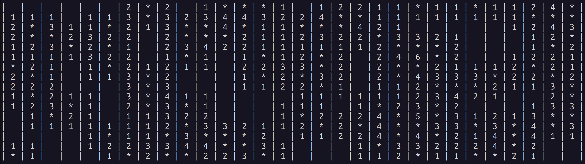

# Minesweeper



A minesweeper simulator and solver written in Go. The solver has 3 modes, executed in the following preference:

### Fully Constrained

The solver generates a matrix with all known constraints. It transforms the matrix to reduced-row echelon form. It then
solves all solvable rows.

Take the following layout:

```
    1   2   3
A |   | 1 | - |
B | 1 | 2 | - |
C | - | - | - |
```

The layout has the following known spaces with unknown neighbors:

```
A2,B2,B1
```

And the following unknown spaces with known neighbors:

```
A3,B3,C1,C2,C3
```

An equation is generated for each of the known spaces which represents its affect on each of the unknown spaces. The
coefficients on the LHS indicate whether the unknown space is affected, the coefficients on the RHS are the number of
unknown mines adjacent to each of the revealed spaces:

```
1(A3) + 1(B3) + 0(C1) + 0(C2) + 0(C3) = 1(A2)
1(A3) + 1(B3) + 1(C1) + 1(C2) + 1(C3) = 2(B2)
0(A3) + 0(B3) + 1(C1) + 1(C2) + 0(C3) = 1(B1)
```

The resulting matrix of coefficients is transformed to reduced-row echelon form:

```
1 1 0 0 0 = 1
0 0 1 1 0 = 1
0 0 0 0 1 = 0
```

The resulting coefficients are then used to either flag or reveal spaces. The generalized algorithm is:

* If the RHS coefficient equals the sum of all positive LHS coefficients
    * All non-zero LHS spaces with positive coefficients are mines
    * All non-zero LHS spaces with negative coefficients are not mines
* If the RHS coefficient equals the sum of all negative LHS coefficients
    * All non-zero LHS spaces with negative coefficients are mines
    * All non-zero LHS spaces with positive coefficients are not mines

In the above example, the sum of the negative LHS coefficients for row 3 is 0, which equals the RHS (also 0). In this
case all positive coefficients (namely `C3`) are not mines.

The calculation is re-run until all possible moves are made. When no more moves are found, the solver moves on to
enumeration.

This algorithm is based on Robert Massaioli's post[^1].

### Enumeration

The solver enumerates every possible solution to the currently known constraints. If non-overlapping sets of constraints
exist, it enumerates each set separately. For each solution found, it records the number of flagged spaces and the
specific spaces which were revealed.

The solver discards any solutions whose combined flag count exceeds the number of remaining mines on the field. For the
viable
solutions, it calculates the probability of each space being mine-free as the number of times the space was revealed
divided by the number of solutions found.

If any space is revealed or flagged in all possible solutions, the space is revealed or flagged. If no certain moves
are found, the solver compares the constrained space with the highest probability of being empty to the probability of
an unconstrained space being empty. If the constrained space's probability is greater, the solver reveals it.
Otherwise, the solver moves on to unconstrained guessing.

This algorithm is based on Chris Studholme's paper[^2].

### Unconstrained Guessing

The solver reveals an unconstrained space in the following order of preference:

1. A corner space
2. An edge space
3. A center space

If all spaces are constrained, it reveals a constrained space in the same order of preference.

## Performance

Benchmarks were performed on 8-cores of an AMD EPYC 7313P CPU.

For beginner fields:

```
$ time ./minesweeper -width 9 -height 9 -mines 10 -games 1000000
Games Simulated: 1000000, Win Ratio: 90.9%, Moves/Win: 30.4, Guesses/Win: 1.62
real 1m 6.01s
user 6m 47.85s
sys 0m 14.27s
```

For advanced fields:

```
$ time ./minesweeper -width 16 -height 16 -mines 40 -games 1000000
Games Simulated: 1000000, Win Ratio: 75.5%, Moves/Win: 123.4, Guesses/Win: 2.11
real 6m 42.30s
user 47m 4.41s
sys 1m 19.04s
```

For expert fields:

```
$ time ./minesweeper -width 30 -height 16 -mines 99 -games 1000000
Games Simulated: 1000000, Win Ratio: 31.9%, Moves/Win: 309.6, Guesses/Win: 4.24
real 1h 51m 04s
user 14h 26m 08s
sys 4m 12.85s
```

The above win ratios reflect those in David Becerra's thesis[^3].

## Building

You can compile and execute the binary with:

```
go build -v
./minesweeper --help
```

Or build a container and execute it with:

```
docker build -t minesweeper .
docker run -it --rm minesweeper --help
```

The available flags are:

```
  -games int
        number of games (default 1000)
  -height int
        height of the field (default 16)
  -mines int
        number of mines (default 99)
  -visualize
        visualize gameplay
  -width int
        width of the field (default 30)
```

Only a single game is played if `visualize` is specified.

## Testing

```
cd solver/
go test
```

The tests run with visualize enabled:

```
|   | 1 | - |
| 1 | 2 | - |
| - | - | - |

resolving constraints

    5    6    8    7    2
    U    U    R    U    U
  1.0  0.0  0.0  0.0  1.0 |  1.0 1
  0.0  1.0  0.0  1.0  0.0 |  1.0 3
  0.0  0.0  0.0  0.0  0.0 |  0.0 4

space 8 revealed by constraints

|   | 1 | - |
| 1 | 2 | - |
| - | - | 2 |

resolving constraints

    2    7    5    6
    R    F    F    R
  0.0  0.0  0.0  0.0 |  0.0 1
  0.0  0.0  0.0  0.0 |  0.0 3
  0.0  0.0  0.0  0.0 |  0.0 8

space 2 revealed by constraints

|   | 1 | 1 |
| 1 | 2 | - |
| - | - | 2 |

space 7 flagged by constraints

|   | 1 | 1 |
| 1 | 2 | - |
| - | * | 2 |

space 5 flagged by constraints

|   | 1 | 1 |
| 1 | 2 | * |
| - | * | 2 |

space 6 revealed by constraints

|   | 1 | 1 |
| 1 | 2 | * |
| 1 | * | 2 |
```

[^1]: https://massaioli.wordpress.com/2013/01/12/solving-minesweeper-with-matricies/

[^2]: https://www.cs.toronto.edu/~cvs/minesweeper/minesweeper.pdf

[^3]: https://dash.harvard.edu/bitstream/handle/1/14398552/BECERRA-SENIORTHESIS-2015.pdf#cite.studholme2000minesweeper
