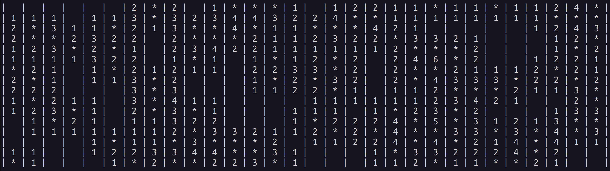

# Minesweeper



A minesweeper simulator and solver written in Rust. The solver has three modes, executed in the following preference:

### Fully Constrained

The solver generates a matrix with all known constraints. It transforms the matrix to RREF. It then solves all solvable
rows.

Take the following layout:

```
    1   2   3
A |   | 1 | - |
B | 1 | 2 | - |
C | - | - | - |
```

The layout has the following known spaces with unknown neighbors:

```
A2,B2,B1
```

And the following unknown spaces with known neighbors:

```
A3,B3,C1,C2,C3
```

An equation is generated for each of the known spaces which represents its effect on each of the unknown spaces. The
coefficients on the LHS indicate whether the unknown space is affected, the coefficients on the RHS are the number of
unknown mines adjacent to each of the revealed spaces:

```
1(A3) + 1(B3) + 0(C1) + 0(C2) + 0(C3) = 1(A2)
1(A3) + 1(B3) + 1(C1) + 1(C2) + 1(C3) = 2(B2)
0(A3) + 0(B3) + 1(C1) + 1(C2) + 0(C3) = 1(B1)
```

The resulting matrix of coefficients is transformed to RREF:

```
1 1 0 0 0 = 1
0 0 1 1 0 = 1
0 0 0 0 1 = 0
```

The resulting coefficients are then used to either flag or reveal spaces. The generalized algorithm is:

* If the RHS coefficient equals the sum of all positive LHS coefficients
    * All non-zero LHS spaces with positive coefficients are mines
    * All non-zero LHS spaces with negative coefficients are not mines
* If the RHS coefficient equals the sum of all negative LHS coefficients
    * All non-zero LHS spaces with negative coefficients are mines
    * All non-zero LHS spaces with positive coefficients are not mines

In the above example, the sum of the negative LHS coefficients for row 3 is 0, which equals the RHS (also 0). In this
case all positive coefficients (namely `C3`) are not mines.

The calculation is re-run until all possible moves are made. When no more moves are found, the solver moves on to
enumeration.

This algorithm is based on Robert Massaioli's post[^1].

### Enumeration

The solver generates every possible solution to the currently known constraints. If non-overlapping sets of constraints
exist, it enumerates each set separately. For each solution found, it records the number of flagged spaces and the
specific spaces which were revealed.

The solver discards any solutions whose combined flag count exceeds the number of remaining mines on the field. For the
viable
solutions, it calculates the probability of each space being mine-free as the number of times the space was revealed
divided by the number of solutions found.

If any space is revealed or flagged in all possible solutions, the space is revealed or flagged. If no certain moves
are found, the solver compares the constrained space with the highest probability of being empty to the probability of
an unconstrained space being empty. If the constrained space's probability is greater, the solver reveals it.
Otherwise, the solver moves on to unconstrained guessing.

This algorithm is based on Chris Studholme's paper[^2].

### Unconstrained Guessing

The solver reveals an unconstrained space in the following order of preference:

1. A corner space
2. An edge space
3. A center space

If all spaces are constrained, it reveals a constrained space in the same order of preference.

## Performance

Benchmarks were performed on an AMD Ryzen 9 9950X CPU.

For beginner fields:

```
$ docker run --rm minesweeper --width 9 --height 9 --mines 10 --games 1000000
Games Simulated: 1000000, Win Ratio: 91.0%, Moves/Win: 30.4, Guesses/Win: 1.61

real    0m3.392s
user    1m47.184s
sys     0m0.577s
```

For advanced fields:

```
$ docker run --rm minesweeper --width 16 --height 16 --mines 40 --games 1000000
Games Simulated: 1000000, Win Ratio: 75.6%, Moves/Win: 123.1, Guesses/Win: 2.09

real    0m24.087s
user    12m45.056s
sys     0m4.072s
```

For expert fields:

```
$ docker run --rm minesweeper --width 30 --height 16 --mines 99 --games 1000000
Games Simulated: 1000000, Win Ratio: 32.5%, Moves/Win: 309.1, Guesses/Win: 4.11

real    3m36.941s
user    64m41.138s
sys     0m9.847s
```

The above win ratios reflect those in David Becerra's thesis[^3].

## Building

You can compile and execute the binary with:

```
cargo build --release
./target/release/minesweeper --help
```

Or build a container and execute it with:

```
docker build -t minesweeper .
docker run --rm minesweeper --help
```

The available flags are:

```
  -w, --width <WIDTH>        width of the field [default: 30]
  -H, --height <HEIGHT>      height of the field [default: 16]
  -m, --mines <MINES>        number of mines [default: 99]
  -g, --games <GAMES>        number of games [default: 1000]
  -v, --visualize            visualize gameplay
  -p, --progress             show progress
  -h, --help                 Print help
```

Only a single game is played if `--visualize` is specified.

## Testing

```
cargo test -- --nocapture
```

The tests run with visualization output enabled:

```
|   | 1 | - |
| 1 | 2 | - |
| - | - | - |

resolving constraints

    5    6    8    7    2
    U    U    R    U    U
  1.0  0.0  0.0  0.0  1.0 |  1.0 1
  0.0  1.0  0.0  1.0  0.0 |  1.0 3
  0.0  0.0  0.0  0.0  0.0 |  0.0 4

space 8 revealed by constraints

|   | 1 | - |
| 1 | 2 | - |
| - | - | 2 |

resolving constraints

    2    7    5    6
    R    F    F    R
  0.0  0.0  0.0  0.0 |  0.0 1
  0.0  0.0  0.0  0.0 |  0.0 3
  0.0  0.0  0.0  0.0 |  0.0 8

space 2 revealed by constraints

|   | 1 | 1 |
| 1 | 2 | - |
| - | - | 2 |

space 7 flagged by constraints

|   | 1 | 1 |
| 1 | 2 | - |
| - | * | 2 |

space 5 flagged by constraints

|   | 1 | 1 |
| 1 | 2 | * |
| - | * | 2 |

space 6 revealed by constraints

|   | 1 | 1 |
| 1 | 2 | * |
| 1 | * | 2 |
```

[^1]: https://massaioli.wordpress.com/2013/01/12/solving-minesweeper-with-matricies/

[^2]: https://www.cs.toronto.edu/~cvs/minesweeper/minesweeper.pdf

[^3]: https://dash.harvard.edu/bitstream/handle/1/14398552/BECERRA-SENIORTHESIS-2015.pdf#cite.studholme2000minesweeper
